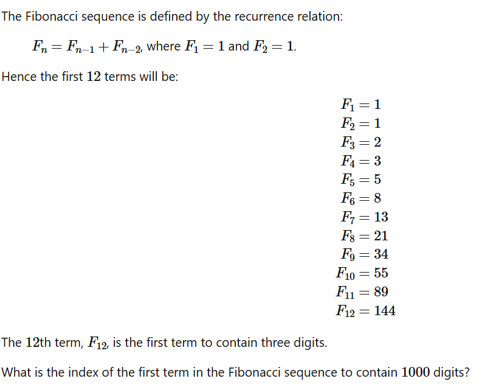

<div align="center">

# Отчёт по лабораторной работе №1
## по курсу "Функциональное программирование"

</div>

---

### **Титульный лист**

|                          |                                                                |
| ------------------------ | -------------------------------------------------------------- |
| **Университет**          | Университет ИТМО                                               |
| **Факультет**            | Факультет программной инженерии и компьютерной техники (ПИиКТ) |
| **Направление**          | Программная инженерия                                          |
| **Дисциплина**           | Функциональное программирование                                |
| **Студент**              | Дмитриев Дениис                                            |
| **Группа**               | P3312                             |
| **Преподаватель**        | Сиразетдинов Азат Ниязович                     |
| **Дата сдачи**           | 17.10.2025                            |

<br/>

---

### **1. Описание проблемы**

В рамках лабораторной работы было предложено решить 2 задачи с Project Euler следующими способами:
1.монолитные реализации с использованием:
 a. хвостовой рекурсии;
 b. рекурсии (вариант с хвостовой рекурсией не является примером рекурсии);

2. модульной реализации, где явно разделена генерация последовательности, фильтрация и   свёртка (должны использоваться функции reduce/fold, filter и аналогичные);
3. генерация последовательности при помощи отображения (map);
4. работа со спец. синтаксисом для циклов (где применимо);
5. работа с бесконечными списками для языков, поддерживающих ленивые коллекции или итераторы как часть языка (к примеру Haskell, Clojure);
6. реализация на любом удобном для вас традиционном языке программирования для сравнения. 

#### **Задача 5: Наименьшее кратное**

2520 is the smallest number that can be divided by each of the numbers from 1 to 10 without any remainder.

What is the smallest positive number that is evenly divisible by all of the numbers from 1 to 20?

#### **Задача 25: 1000-значное число Фибоначчи**



### **2. Ключевые элементы реализации**

Для каждой задачи были реализованы все предложенные решения из списка описания работы, демонстрирующих различные приёмы и абстракции функционального программирования, а также сравнительная реализация на языке Python.

#### **Реализация для Задачи 5 на Haskell**

##### **1. Рекурсия (без хвостика)**
Рекурсивный подход, где результат вычисляется на обратном ходе рекурсии.

```haskell
findLCM1_1 :: [Int] -> Int
findLCM1_1 [] = 1
findLCM1_1 (x:xs) = lcm x (findLCM1_1 xs)
```

##### **1.1 Рекурсия (с хвостиком)**
Оптимизированная рекурсия с использованием аккумулятора для предотвращения переполнения стека.

```haskell
findLCM1_2 :: [Int] -> Int
findLCM1_2 xs = go xs 1
    where
        go [] acc = acc
        go (x:xs') acc = go xs' (lcm acc x)
```

##### **2. Свёртка (`foldl`)**
Решение с использованием ФПВ foldl(левая свёртка).

```haskell
findLCM2 :: [Int] -> Int
findLCM2  = foldl lcm 1
```

#### **3. Решение через map
```haskell 
findLCM345 :: Int -> Bool
findLCM345 n = all (\d -> n `mod` d == 0) [11..20]
head $ filter findLCM345 (map (*2520) [1..])
```
#### **4. Работа со спец синтаксисом 
```haskell
head $ filter findLCM345 [2520, 5040..]
```

#### **Реализация для Задачи 25 на Haskell**

##### **0. Решение через формулу Бине(привет продмат)**
Математическое решение данной задачки.

```haskell
findDigitsFib :: Int -> Int
findDigitsFib n = ceiling ((fromIntegral n - 1 + logBase 10 (sqrt 5) :: Double) / logBase 10 phi)
    where phi = (1 + sqrt 5) / 2 :: Double
```
##### **1 Решение через рекурсию.**
На этот раз рекурсия. Тяжелее чем хвостовая рекурсия, но для наших чисел заходит.

```haskell
findDigitsFib1_1 :: Int -> Int
findDigitsFib1_1 n = fst $ findFib 0 0 1
  where
    target = 10 ^ (n - 1) :: Integer
    findFib :: Int -> Integer -> Integer -> (Int, Integer)
    findFib ind a b
      | a >= target = (ind, a)
      | otherwise   = findFib (ind + 1) b (a + b)
```


##### **1.1 Решение через хвостовую рекурсию.**

Здесь обычный хвост. Кстати, компилятор это оптимизирует в итеративный цикл как в решении на Python.

```haskell
-- src/Task25/Solution.hs
findDigitsFib1 :: Int -> Int
findDigitsFib1 n = go 0 0 1
  where
    target = 10 ^ (n - 1) :: Integer
    go :: Int -> Integer -> Integer -> Int
    go ind a b
      | a >= target = ind
      | otherwise = go (ind + 1) b (a + b)
```

##### **2 и 3. map и dropWhile.**
Здесь очень хорошо подошёл map чтобы отбросить числа + dropWhile

```haskell
findDigitsFib235 :: Int -> Int
findDigitsFib235 n =
  let indexed = zip [0 ..] fibs
   in fst $ head $ dropWhile (\(_, x) -> x < 10 ^ (n - 1)) indexed
```


##### **4 и 5. Бесконечные списки и списковые включения**
Генерация бесконечной последовательности чисел Фибоначчи и поиск нужного элемента с помощью списковых включений.

```haskell
fibs :: [Integer]
fibs = 0 : 1 : zipWith (+) fibs (tail fibs)

findDigits4 :: Int -> Int
findDigits4 n = head [i | (i, fib) <- zip [0..] fibs, fib >= 10^(n-1)]
```


#### **Сравнительная реализация на пайтоне**

##### **Задача 5**
Функциональный стиль в Python с использованием `functools.reduce` очень похож на `foldl` в Haskell, btw

```python
from math import lcm
from functools import reduce

answer = reduce(lcm, range(1, 21))
print(answer)
```

##### **Задача 25**
Классический императивный подход с циклом `while` и изменяемыми переменными.

```python
def fib():
    a, b = 0, 1
    n = 0
    while True:
        a, b = b, a + b
        n += 1
        if a >= 10**999:
            return n
print(fib())
```


### **3. Выводы**

В ходе выполнения лабораторной работы были освоены и применены на практике ключевые концепции функционального программирования:

*   **Рекурсивные решения** (хвостовая и обычная) хорошо демонстрируют базовые принципы ФП, но требуют понимания того как они работают и как раскладываются, иначе могут не подходить по задачам
*   **Функции высшего порядка (`fold`, `map`, `filter`)** оказались наиболее мощным и идиоматичным инструментом в Haskell. Решения, написанные с их использованием, получаются декларативными и лаконичными, а это хорошо. 
*   **Ленивые вычисления и бесконечные списки** — уникальная и сильная сторона Haskell. Прикольная реализация через лень: она позволяет элегантно разделять логику генерации бесконечной последовательности от логики её потребления, как это сделано в решении задачи о числах Фибоначчи.
*   **Сравнение с Python** наглядно показало разницу в парадигмах. Императивный код на Python часто более многословен и смешивает логику в циклах, в то время как функциональный подход в Haskell позволяет строить решения из независимых, композируемых блоков.

В целом, функциональный подход стимулирует написание более модульного, тестируемого и выразительного кода.